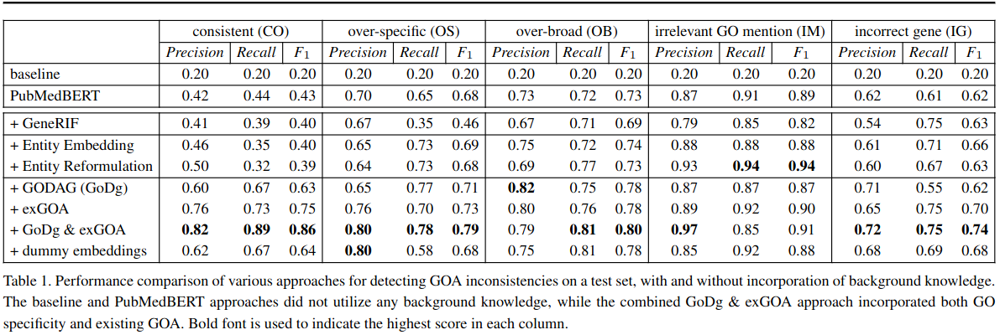
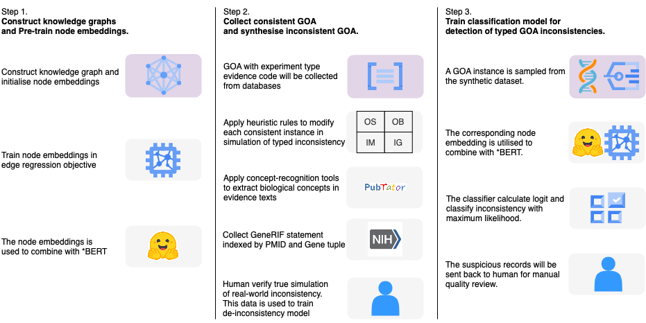
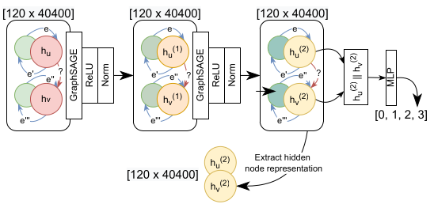
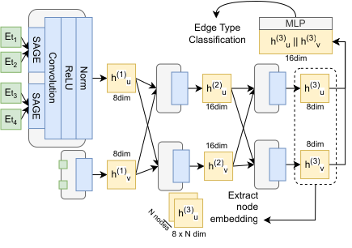
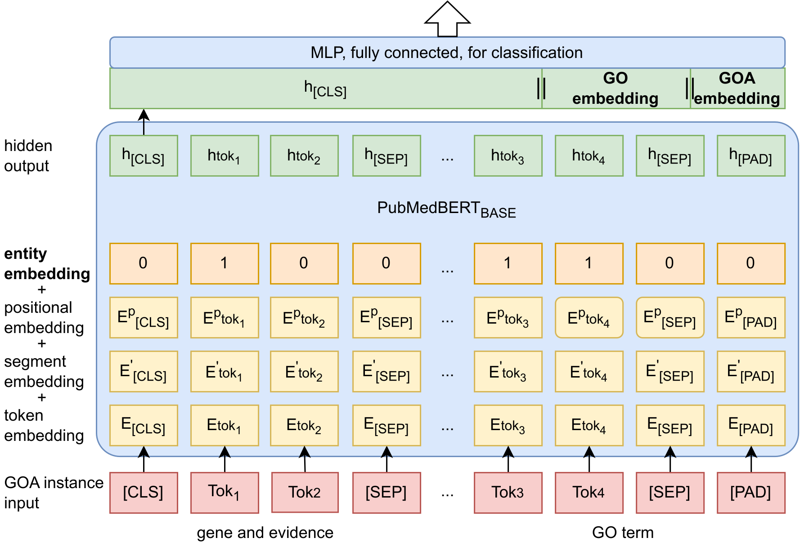

# De-inconsistency for GOA

Automatic detection of inconsistency for literature-based Gene Onology Annotation 

## Intoduction
### Motivation: 
Biological background knowledge plays an important role in the manual quality assurance of biological database records, such as the detection of inconsistencies in literature-based Gene Ontology Annotation (GOA). The Gene Onology provides a standardized and comprehensive description of gene function information, and its use in GOA to associate specific genes with specific functions supports biological research. However, inconsistencies can be identified between the literature used as evidence, GO terms, and annotated genes in GOA records. Existing automatic approaches for the detection of semantic inconsistencies in GOA have limited applicability in real-world scenarios due to their reliance on limited evidence and lack of integration with relevant domain-specific background knowledge. This paper investigates various types of background knowledge that could improve the detection of inconsistencies
in GOA. Additionally, the paper proposes several approaches that integrate background knowledge into the automatic GOA inconsistency detection process.

This release contain the source code for the detection of self-consistency and four types of semantic inconsistency between a triplet of GO term, gene product, and direct literature evidence in GOA instance.

For example, giving an inconsistent GOA as below:

🧬 Mtor (GeneID:36264) \
📖 At anaphase, 𝑀𝑡𝑜𝑟 plays a role in spindle elongation, thereby affecting normal chromosome movement. (PMID: 	19273613) \
🏷️ spindle (GO:0005819)

🤔Decision: irrelevant GO mention

Reason: the evidence does not indicate 𝑀𝑡𝑜𝑟 locates at ``spindle''

### Documentation ###
- An instruction for reproducing the result or making inconsistency detection on customized dataset can be found in `modelling/`
- The instruction for pre-training embedding for encoding existing GOA on customized dataset can be found in `exGOA pre-training/`
- The instruction for pre-training embedding for encoding GO DAG on customized split can be found in `GO-DAG pre-training/`

## Results

## Conclusion
Our study demonstrated the feasibility of integrating biological background knowledge for automatic detection of semantic inconsistency in GOA. Specifically, we found the performance can be significantly improved if key named entities (biological concept) are pre-extracted from the context, the GO specificity knowledge is incorporated, and the exiting GOA is referred.

## Method

Figure 1. Overview of GOA inconsistency detection

### Structure of GNN for incoporating GO specificity knowledge from the GO Direct Acyclic Graph (GO-DAG)

Figure 2. Architecture of Graph Neural Network (GNN) with the objective of edge type classification for encoding GO specificity knowledge. _${h_u^n}$_ denotes the vector of vertex u in the nth layer of GNN; e denotes the edge type vector; ∥ denotes flat concatenation of vectors; ReLU denotes Rectified Linear Unit, the activation function; Norm denotes batch normalization; MLP denotes single-layered multi-layer perceptron.

### Structure of GNN for incoporating existing GO annotation (GOA)

Figure 3. Architecture of Graph Neural Network (GNN) with the objective of edge type classification for encoding existing GOA patterns. Etn denotes the initial vectorization of node n representation. _${h_u^n}$_ denotes the hidden representation of node u in the nth layer of GNN; SAGE denotes the GraphSAGE sub-layer for aggregation of node features passed through same type of edges; Convolution aggregate output of SAGE sub-layers; ReLU denotes the Rectified Linear Unit, which is the activation function; Norm denotes batch normalization; ∥ denotes the flat concatenation of two node vectors; MLP denotes single-layered multi-layer perceptron.

### Structure of GNN-BERT for Background Knowledge Integration from Gene Ontology Hierarchy

Figure 4. Architecture of joint model for GOA inconsistency detection, with the addition of entity layer in the input. Tok∗ denotes a linguistic token, E∗ and h∗ denote a token embedding, [CLS] and [SEP] are special tokens marking the boundary of an input pair. The highlighted entity embedding layer illustrates a case where tok1 , tok3, and tok4 are part of the pre-extracted biological concepts and thus were encoded in digit 1. This figure demonstrates the combination of h[cls], GODAG, and GOA KG.

## Authors

- [Jiyu Chen](https://jiyuc.github.io)
- Benjamin Goudey
- Nicholas Geard
- Justin Zobel
- Karin Verspoor

## Citation

Please consider citing one of the published works:

- Chen, J., Goudey, B., Zobel, J., Geard, N. and Verspoor, K., 2023. Integrating Background Knowledge for detection of inconsistency for literature-based Gene Ontology Annotation, In Progress.

- [Chen, J., Goudey, B., Zobel, J., Geard, N. and Verspoor, K., 2022. Exploring automatic inconsistency detection for literature-based gene ontology annotation. Bioinformatics, 38(Supplement_1), pp.i273-i281.](https://academic.oup.com/bioinformatics/article/38/Supplement_1/i273/6617491)

- [Chen, J., Geard, N., Zobel, J. and Verspoor, K., 2021. Automatic consistency assurance for literature-based gene ontology annotation. BMC bioinformatics, 22(1), pp.1-22](https://bmcbioinformatics.biomedcentral.com/articles/10.1186/s12859-021-04479-9)

